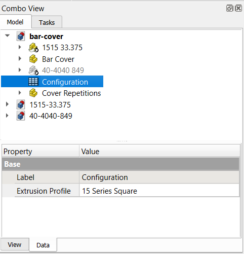
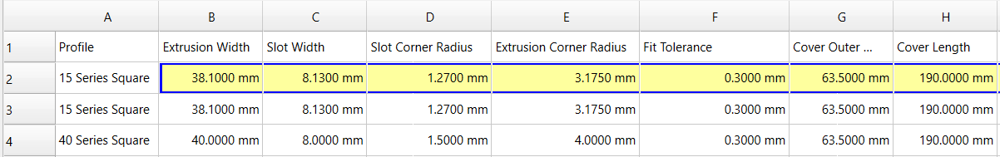

# Reflex Extrusion Bar

Printable cover for using a square t-slot extrusion as the horizontal component of a RE:Flex bar.

[Pre-generated STL files](./stl/)

Outer diameter is 2.5". Two different versions fit 15 series or 40 series extrusions respectively.

Attaches with a 5/16-18 x 5/8" or M8 x 16mm Button Head Socket Cap screw and a matching T Nut.

## Editing the parameters of the model for a custom configuration

To switch to the 40 Series configuration, select the spreadsheet labeled "Configuration" in the FreeCAD combo view, and edit the Extrusion Profile property in the Data tab.

You can edit several of the cells in the spreadsheet to customize the cover. 

- Cover Length (The length of the printed part.)
- Number of Sections (This will update the number of cover sections visible in the 3D View, up to 6 maximum. This is just for reference since they are all copies of the same part.)

Other properties that you can edit, not extensively tested:

- Cover Outer Radius (For a thicker bar? It can't go much smaller.)
- Screw Offset (If you don't want the screw hole centered.)
- Fit Tolerance (If the cover fits too tightly or not tightly enough.)

The Bar Cover CAD design uses what's called a Configuration Table to switch between several predefined configurations. When editing the spreadsheet, modify the 3rd or 4th row depending on whether you are using a 15 series or 40 series profile. Since most of the editable values are the same between the two configurations, they don't really need to go in the configuration table and get duplicated twice, but I got it working like that and left it alone.

Guide on Exporting STLs from FreeCAD:

https://wiki.freecad.org/Export_to_STL_or_OBJ
