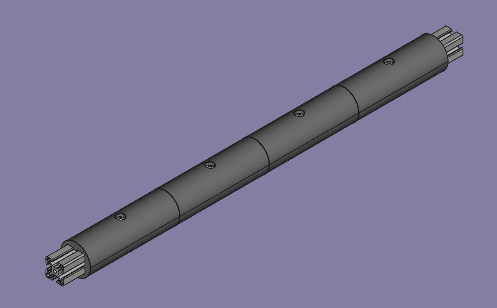
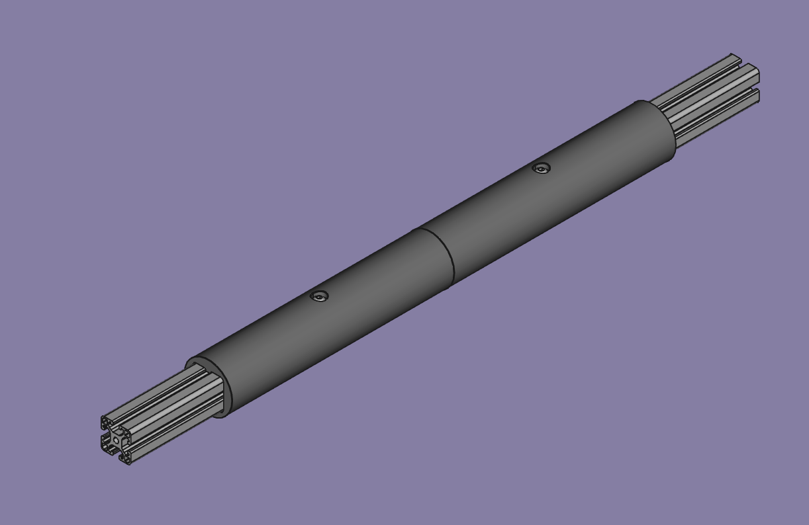

Printable cover for using a square t-slot extrusion as the horizontal component of a RE:Flex bar.

Outer diameter is 2.5". Two different versions fit 15 series or 40 series extrusions respectively.

Attaches with a 5/16-18 x 5/8" or M8 x 16mm Button Head Socket Cap screw and a matching T Nut.

Cover length is parametric. Open bar-cover.FCStd with FreeCAD, edit the configuration spreadsheet if desired, and export from there.

https://wiki.freecad.org/Export_to_STL_or_OBJ